# bus-registration-system

[Working demo](https://bus-registration.herokuapp.com/)
[Project documentation](https://agh-computer-science-projects.github.io/docs/)

To build project run command `./gradlew build`

To run project run command `./gradlew bootRun`

To run tests run command `./gradlew test`

App listens on port `8080`

 

  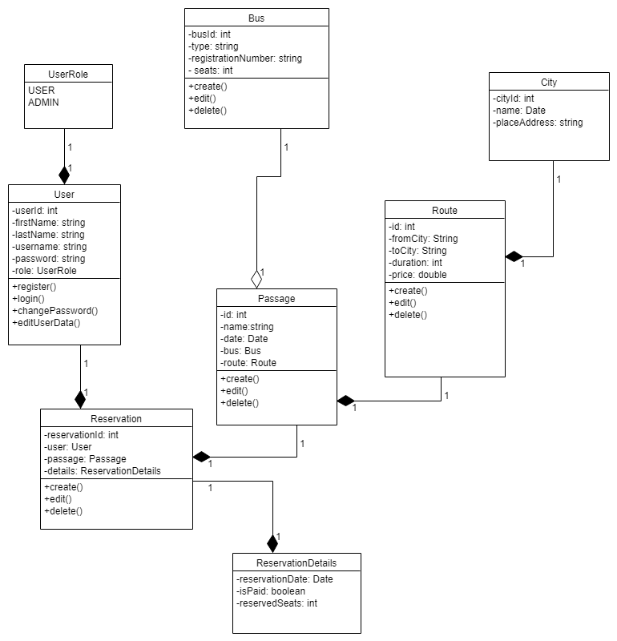
  
Class diagram

  

  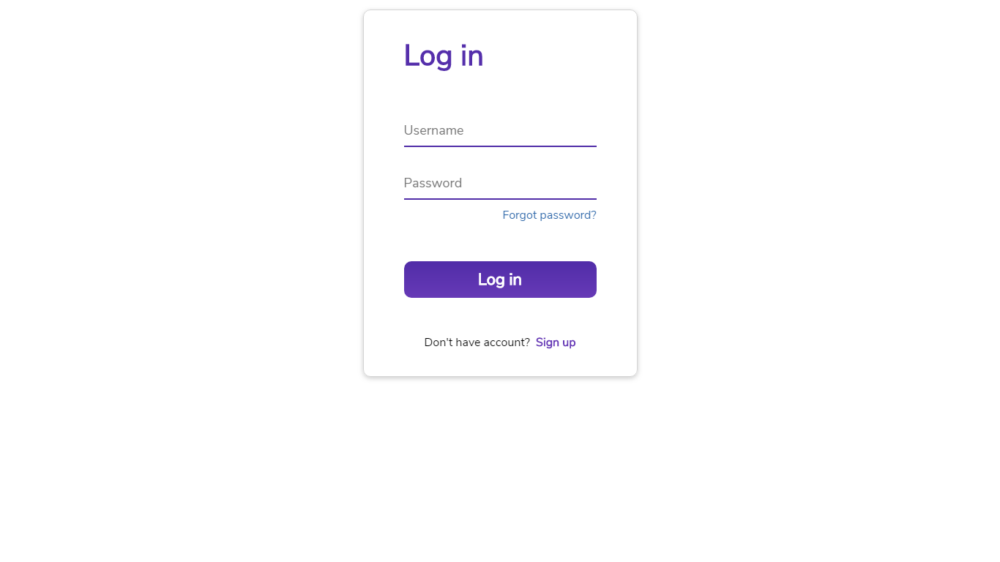
  
View 1 - Login Page

  

  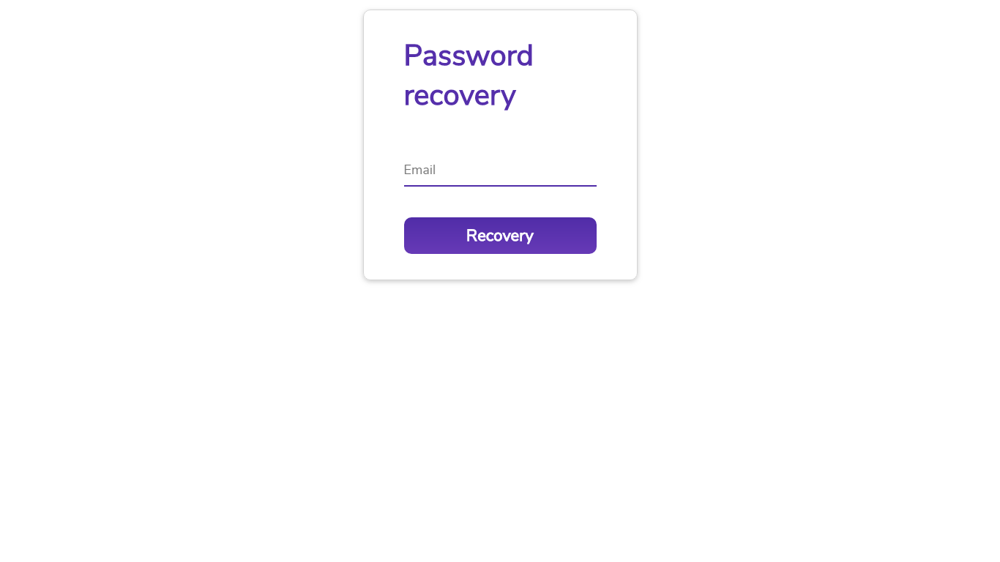
  
View 2 - Password Recovery Page

  

  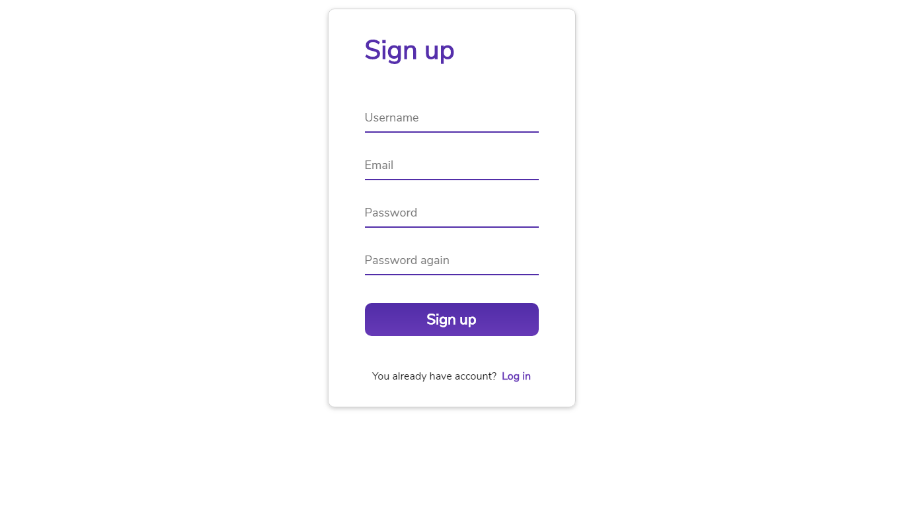
  
View 3 - Sign Up Page

  

  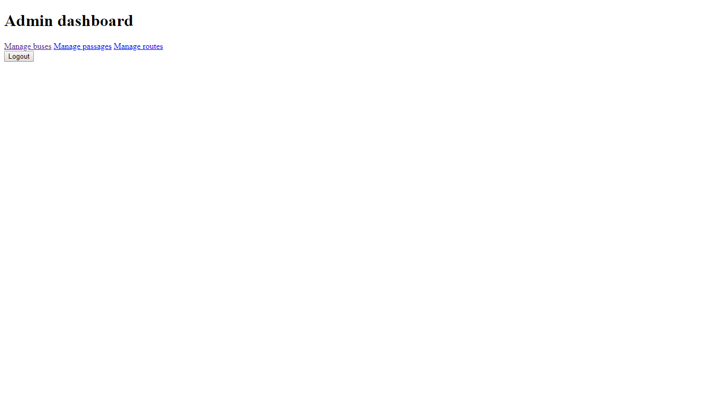
  
View 4 - Admin Dashboard

  

  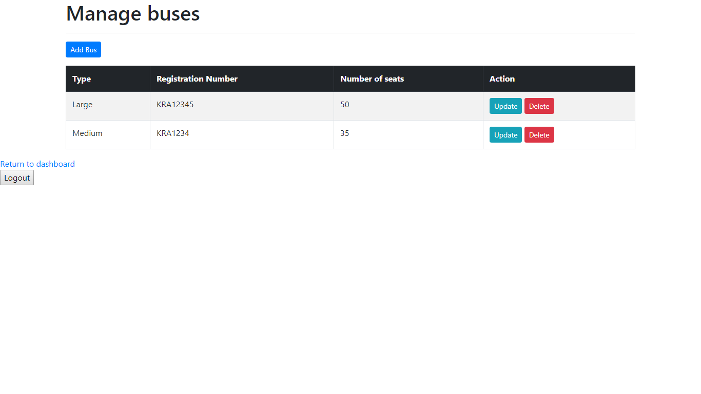
  
View 5 - Admin: Manage Buses

  

  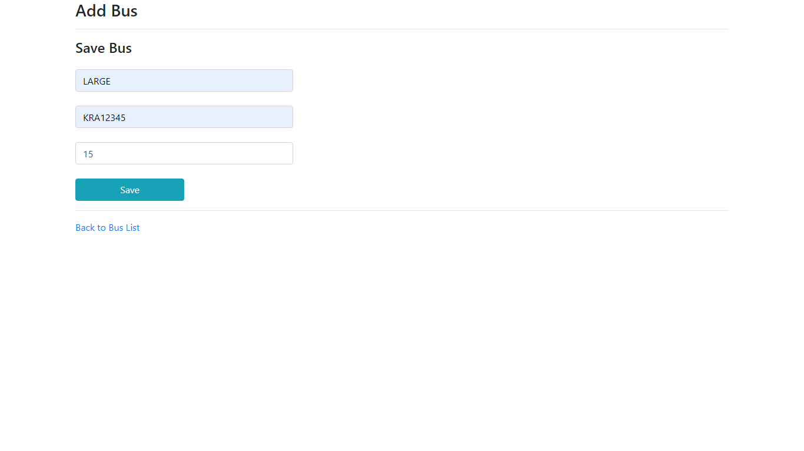
  
View 6 - Admin: Add or Update Bus

  

  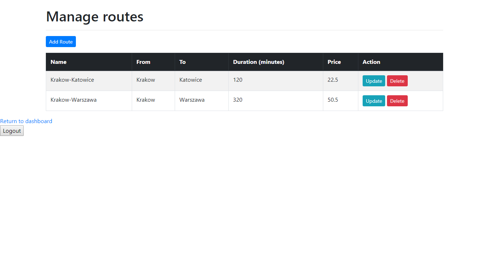
  
View 7 - Admin: Manage Routes

  

  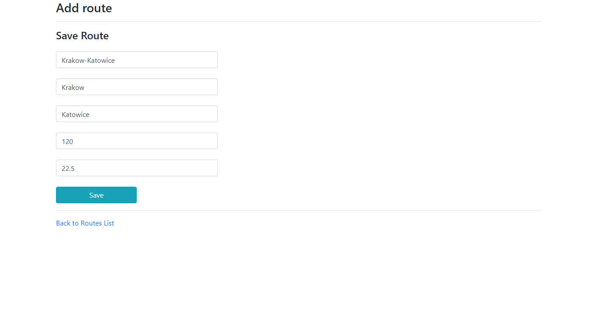
  
View 8 - Admin: Add or Update Route

  

  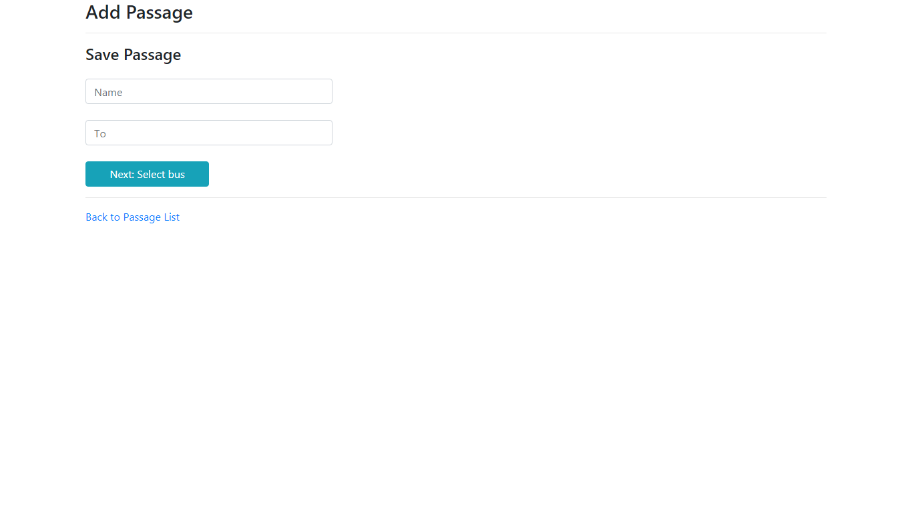
  
View 6 - Admin: Add Passage

  

  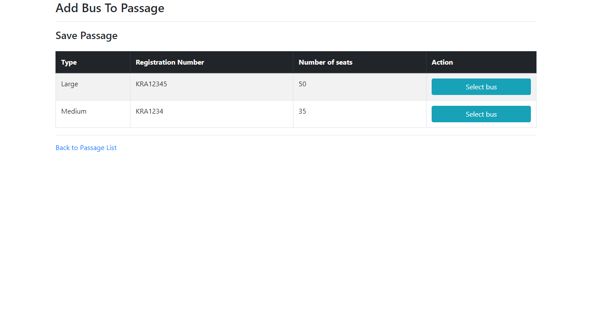
  
View 10 - Admin: Add Bus to Passage

  

  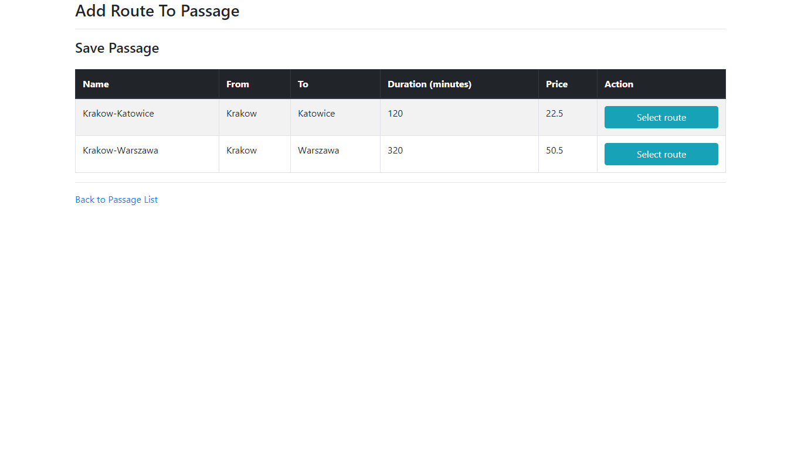
  
View 11 - Admin: Add Route to Passage

  

  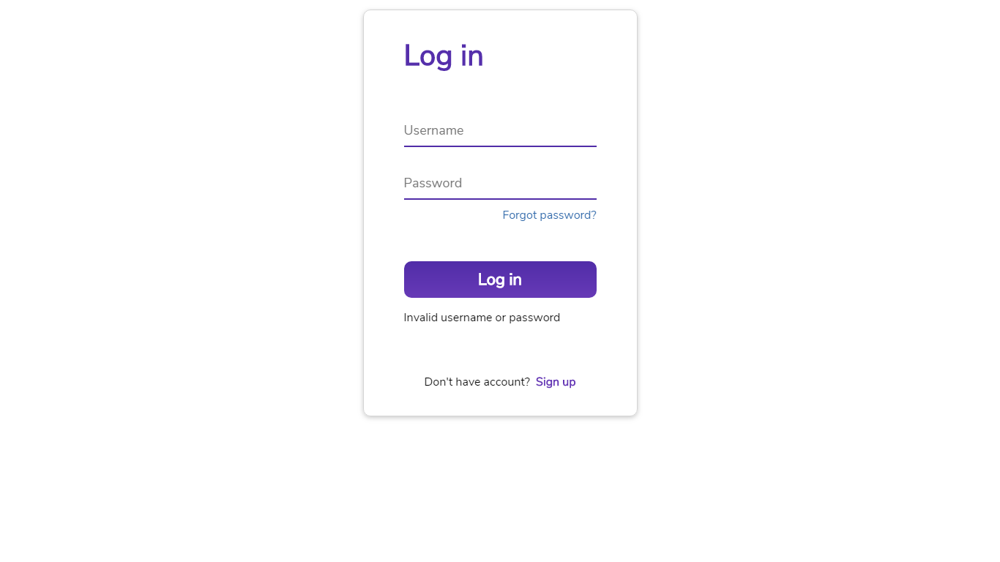
  
View 12 - Login page: invalid username message

  

  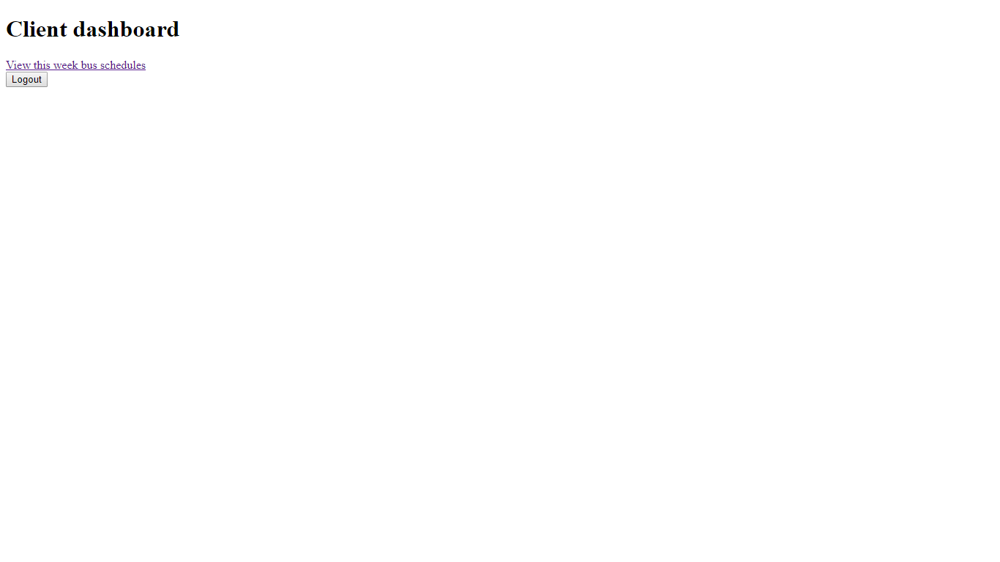
  
View 13 - Client: Client dashboard

  
